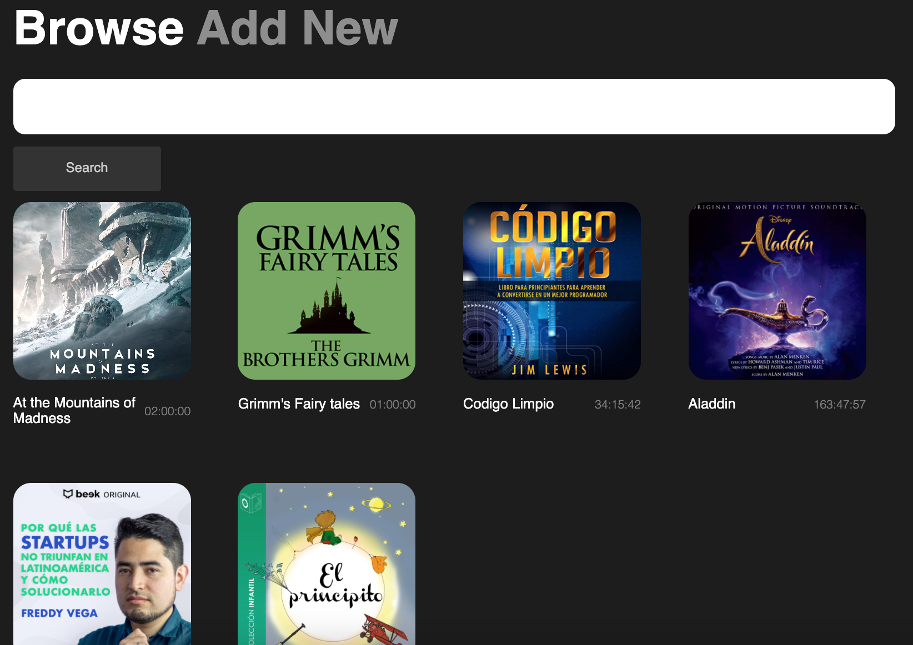
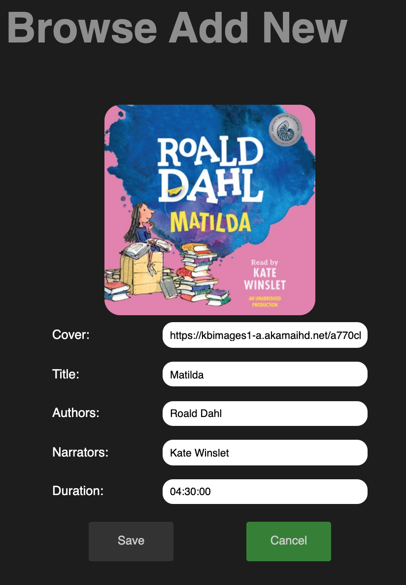

# BeekChallenge

### Instruccions.

Install all dependecies.

```bash
yarn install
```

Create .env file including envioroment variables values:

```
REACT_APP_API_TOKEN=API_TOKEN_HERE
REACT_APP_API_ENVIROMENT=API_ENVIROMENT_HERE
REACT_APP_API_SPACE_ID=API_SPACE_ID_HERE
REACT_APP_API_X_CONTENTFUL_CONTENT_TYPE=CONTENT_TYPE_HERE
```

Run the application:

```bash
yarn start
```

After that we would be ready to navigate through our application.

We can do different actions here:

- If we want to visualize **All the current books** we would find them in **Browse** page.

  

- If we want to search an specific Audiobook in the list, we just type on the finder click Enter or Search and it would show us either the coincidences or the specific Audiobook.


- If we want to **Add a new Audiobook** to our list we need to go to **Add new** page, were we can find a form that would ask for the neccesary fields to add a new book.

  

  After filling up the fields we would save our data and now we can find our book in our list of available books.

  

- If we want either **Update** or **Remove** **an Audiobook** we simply click on the desire book and we would find a view like the one below:

  

  If we want to **Update** our book information we simply click "Update". A view like this would appered:

  

  and we save the changes. If regret making changes we simply click "Cancel " and that would redirect us again to Browse page.

  

  But if we want to **Delete** the Audiobook we just click on the desire Audiobook and click on "Delete"

  

  After that we would be redirected to our Audiobook list were the book would be already delete from our List.

  

---

### Libraries and Frameworks

**axios** →Js Library

Used for handling Request and connection with the API.

**React Router**

Routing library used by my application to navigate between different components, changing the browser URL, modifying the browser history, and keeping the UI state in sync.

**styled-components** → Library

Use to create styled components for managing CSS on them

**nanoid** → Packet

use for my unique string ID generator

**prop-types** → Library
